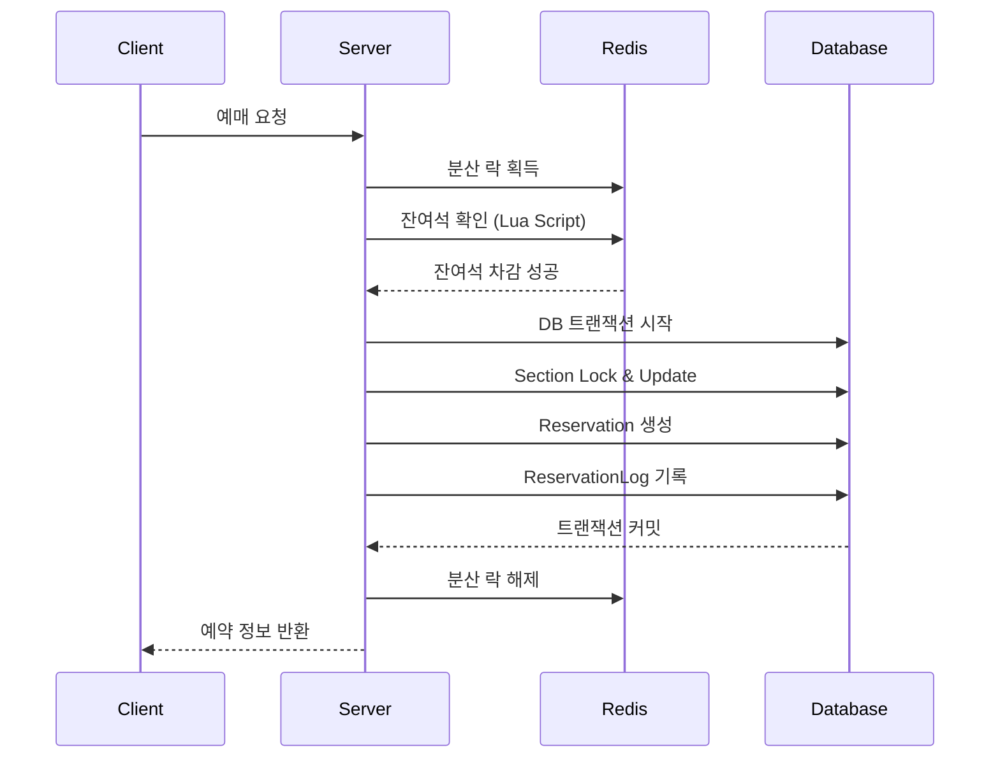
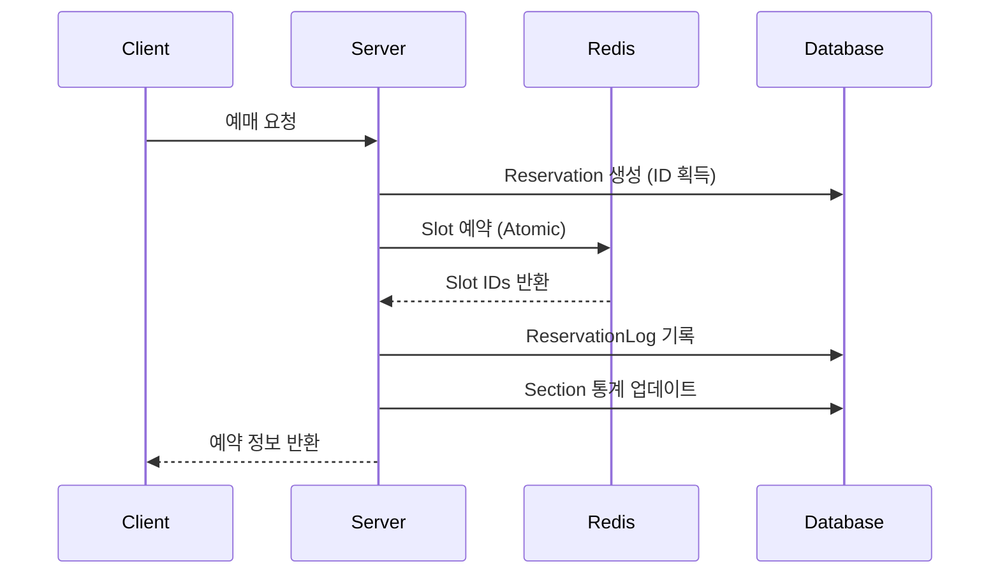

# 예매 프로세스 상세 문서

## 예매 상태 (Reservation Status)

```typescript
enum ReservationStatus {
  PENDING = 'pending',      // 예약 대기 (결제 대기)
  CONFIRMED = 'confirmed',  // 예약 확정
  CANCELLED = 'cancelled',  // 예약 취소
  EXPIRED = 'expired'       // 예약 만료
}
```

## 1. 예매 생성 (Create Reservation)

### 요청 흐름
```
Client → POST /api/reservations
{
  "sectionId": "uuid",
  "quantity": 2,
  "userId": "uuid"
}
```

### Lock 기반 시스템 처리 과정



### Slot 기반 시스템 처리 과정



### 주요 검증 사항
1. 구역 상태 확인 (OPEN 상태인지)
2. 요청 수량 유효성 (최소 1개)
3. 잔여석 확인
4. 사용자 인증

### 실패 시나리오
- 잔여석 부족 → 400 Bad Request
- 구역 미존재 → 404 Not Found
- 구역 닫힘 → 400 Bad Request
- Redis 연결 실패 → 500 Internal Error

## 2. 예매 확정 (Confirm Reservation)

### 요청 흐름
```
Client → POST /api/reservations/:id/confirm
{
  "userId": "uuid"
}
```

### 처리 과정

1. **예약 조회 및 검증**
   - 예약 존재 여부
   - 사용자 일치 여부
   - 현재 상태 확인 (PENDING만 가능)
   - 만료 시간 확인

2. **상태 업데이트**
   - Lock 기반: DB 트랜잭션 내에서 처리
   - Slot 기반: Redis Slot 상태 변경 후 DB 업데이트

3. **결과 반환**
   - 확정된 예약 정보
   - 확인 코드 포함

### 상태 전이
```
PENDING → CONFIRMED (성공)
PENDING → EXPIRED (시간 초과)
```

## 3. 예매 취소 (Cancel Reservation)

### 요청 흐름
```
Client → POST /api/reservations/:id/cancel
{
  "userId": "uuid"
}
```

### 처리 과정

1. **예약 검증**
   - 예약 존재 여부
   - 사용자 권한 확인
   - 취소 가능 상태 확인

2. **자원 반환**
   ```
   Lock 기반:
   - DB 트랜잭션 시작
   - Section 잔여석 증가
   - Redis 카운터 증가
   - Reservation 상태 변경
   
   Slot 기반:
   - Redis Slot 해제
   - DB 업데이트
   ```

3. **로그 기록**
   - 취소 시간
   - 취소 사유 (사용자/시스템)

### 상태 전이
```
PENDING → CANCELLED
CONFIRMED → CANCELLED
```

## 4. 예매 만료 처리 (Expire Reservations)

### 자동 만료 프로세스
- **실행 주기**: 5분마다
- **대상**: 만료 시간이 지난 PENDING 예약

### 처리 과정
```javascript
// 스케줄러가 주기적으로 실행
async function expireReservations() {
  // 1. 만료된 예약 조회
  const expiredReservations = await findExpiredReservations();
  
  // 2. 각 예약에 대해
  for (const reservation of expiredReservations) {
    // 3. 트랜잭션 내에서 처리
    await transaction(async () => {
      // 4. 잔여석 반환
      await releaseSeats(reservation);
      
      // 5. 상태 변경
      reservation.status = 'EXPIRED';
      
      // 6. 로그 기록
      await createLog('EXPIRED', 'system');
    });
  }
}
```

### Slot 기반 시스템의 추가 처리
- TTL 기반 자동 만료
- 고아 Slot 정리 작업

## 5. 예매 조회

### 개별 예매 조회
```
GET /api/reservations/:id?userId=xxx
```

### 사용자별 예매 목록
```
GET /api/reservations/user?userId=xxx&status=confirmed
```

### 캐싱 전략
- 개별 예매: 5분 캐싱
- 사용자 목록: 1분 캐싱
- 상태 변경 시 즉시 무효화

## 예외 처리 및 복구

### 트랜잭션 실패 시
1. DB 롤백 자동 실행
2. Redis 카운터 복구
3. 에러 로그 기록
4. 클라이언트에 에러 응답

### Redis 장애 시
1. DB 기반으로 fallback
2. 성능은 저하되지만 서비스 지속
3. Redis 복구 후 동기화

### 동시성 충돌 시
- Lock 기반: 재시도 로직 (최대 20회)
- Slot 기반: 다른 Slot으로 자동 전환

## 모니터링 포인트

1. **예약 생성 성공률**
   - 목표: 99% 이상
   - 실패 원인 분석

2. **평균 응답 시간**
   - 예약 생성: < 500ms
   - 예약 확정: < 200ms

3. **만료율**
   - 정상 범위: 5-10%
   - 높을 경우 타임아웃 조정 검토

4. **동시성 충돌률**
   - Lock 획득 실패 횟수
   - Slot 부족 발생 빈도